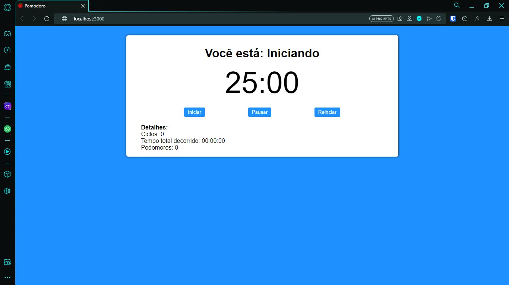
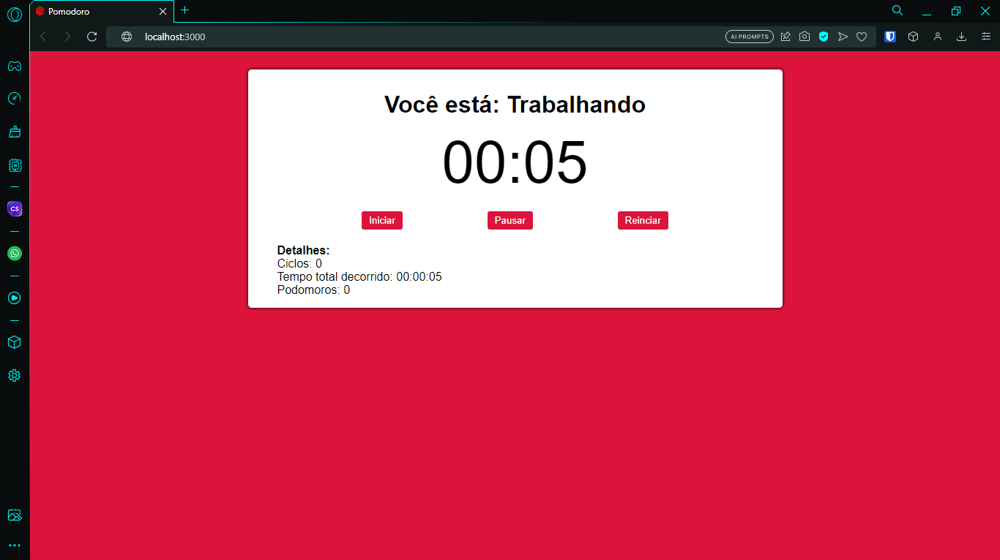
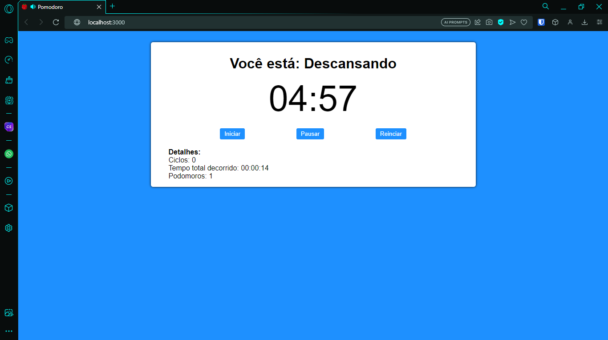

<h1 align="center"> Pomodoro 🍅</h1>

  
  
  

# Índices 🗂
* [Sobre](#sobre-)
* [Screenshots](#screenshots-)
* [Links](#links-)

# Sobre ☄
Este projeto foi realizado com o intuito de praticar os conhecimentos de TypeScript com React. Um Pomodoro simples mas funcional com uma interface simples e prática.

# Screenshots 📸

    
    
    
    

# Links 🔗

* Técnica do pomodoro: [Wikipédia](https://pt.wikipedia.org/wiki/Técnica_pomodoro)

Criado por [Iago Amorim](https://github.com/danonep2).

